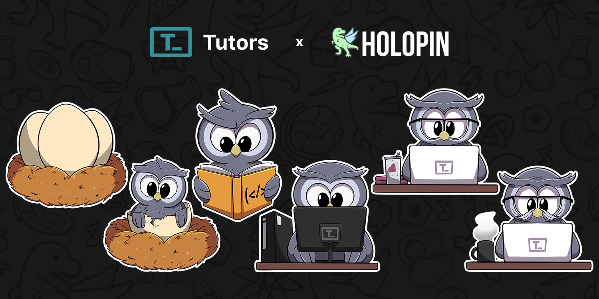

<p align="center">
  <a href="https://tutors.dev">
    <picture>
      <source media="(prefers-color-scheme: dark)"  srcset="./assets/tutors-dark.png">
      <source media="(prefers-color-scheme: light)" srcset="./assets/tutors-light.png">
      
    </picture>    
  </a>
</p>

<h3 align="center">
Tutors: An Open Learning Web Toolkit
</h3>

<p align="center">
  <a href="https://tutors.dev">Website</a> |
  <a href="https://docs.tutors.dev">Documentation</a> |
  <a href="#">Coming Soon</a>
</p>


[](https://app.netlify.com/sites/tutors-dev/deploys) [](https://github.com/tutors-sdk/tutors/actions/workflows/ci.yml) 

# What is Tutors?

A collection of open source components & services supporting the creation of transformative learning experiences using open web standards. Some representative examples:

- [Higher Diploma in Computer Science Portal](https://tutors.dev/course/wit-hdip-comp-sci-showcase)
- [Full Stack Development](https://tutors.dev/course/full-stack-web-dev-oth-2022)
- [Reference Course](https://tutors.dev/course/tutors-reference)
- [Higher Diploma in Computer Science at SETU: 2020-2022](https://tutors.dev/course/wit-hdip-comp-sci-2020)
- [Classic Design Patterns](https://tutors.dev/course/classic-design-patterns)
- [Agile Software Development](https://tutors.dev/course/agile-dev-2021)
- [Technologische Fähigkeiten](https://tutors.dev/course/zusatzstudium-digital-skills-semester1)

# Getting Started

Make sure you have Node 16 + installed, and start by cloning this repo:

```bash
git clone https://github.com/tutors-sdk/tutors.git
```

Open a shell and...

```bash
cd tutors
npm install
```

Change directory into the app folder

```bash
cd app
```

and copy the file `.env.example` to `.env`

```bash
cp .env.example .env
```

Now to start the app you can run this command from the root:

```bash
npm run app
```

Or this command from the app folder:

```bash
npm run dev
```

You should see an output similar to below:

```bash
tutors-app@9.0.0 dev
vite dev --port 3000 --open


VITE v4.4.9  ready in 966 ms

 ➜  Local:   http://localhost:3000/
 ➜  Network: use --host to expose
```

Now the app is up and running and you can browse to it by opening the <a href="http://localhost:3000/">local location</a> in your browser.

The app encompasses all web components of the Tutors project, and the course reader component relies on a segment of the url to locate the course to display. Any of the samples above can be 'read' with an appropriate url segments appended to the local url you now have running. So for instance:

```bash
https://tutors.dev/course/tutors-reference
```

... can be loaded locally by:

```bash
http://localhost:3000/course/tutors-reference
```

(Note the port number may vary - for example 3000)

The 'source' for the above course is here:

- https://github.com/tutors-sdk/tutors-template

You could try any of the other sample courses above.

If you would like to build your own course then [this workshop here](https://tutors.dev/topic/tutors-docs/topic-00-WX) would be a good place to start. In particular, [this lab here](https://tutors.dev/lab/tutors-docs/topic-00-WX/unit-1-creating/book-a) will get you up and running with a sample course in a few minutes. More guidance and examples are on our [Educator documentation](https://tutors.dev/topic/tutors-docs/topic-02-EX) site. To learn more about the project, explore the core principles at https://tutors.dev/.

If you have VSCode, you should be able to open the project.

# Project Structure

This is a monorepo for all of the components & services of the [Tutors Open Source Project](https://tutors.dev/).

## App

The app is the student facing web application for browsing a course, inspecting course analytics + a storybook encapsulation of UX elements. It is a SvelteKit application that renders a course in an appealing, context sensitive user experience. The principles embodied in the [learner experience are presented here](https://tutors.dev/lab/docs.tutors.dev/topic-03-DX/unit-0/book-plans/01).

The app contains grouped routes, sectioned for their purpose. These are explained below:

### [home](<https://github.com/tutors-sdk/tutors/tree/development/app/src/routes/(home)>)

The homepage of Tutors app.

### [auth](<https://github.com/tutors-sdk/tutors/tree/development/app/src/routes/(auth)>)

The authentication routes of the app. The app uses [Supabase](https://supabase.com/) for authentication, using GitHub as the OAuth provider.

### [course-reader](<https://github.com/tutors-sdk/tutors/tree/development/app/src/routes/(course-reader)>)

The main Tutors user experience - demonstrated in the links above. This can be built and launched via the instructions above.

### [time](<https://github.com/tutors-sdk/tutors/tree/development/app/src/routes/(time)>)

This route presents the educational analytics gathered by the application. There is a student + an educator perspective.

## CLI

These are command line applications used by educators to generate courses. The principles embodied in the [educator experience are presented here](https://tutors.dev/lab/docs.tutors.dev/topic-03-DX/unit-0/book-plans/02).

### [tutors-gen-lib](https://github.com/tutors-sdk/tutors/tree/development/cli/tutors-gen-lib)

// Todo

### [tutors-publish](https://github.com/tutors-sdk/tutors/tree/development/cli/tutors-publish)

// Todo

### [tutors-publish-html](https://github.com/tutors-sdk/tutors/tree/development/cli/tutors-publish-html)

// Todo

# Contributing

Please ensure to read the [Code of Conduct](./CODE_OF_CONDUCT.md) before contributing to the Tutors project.

When contributing, pull requests should be opened to the 'development' branch, and once tested this will be merged to main.



All contributors are eligible to earn a [Holopin](https://holopin.io) - a digital badge that represents your contributions to the project. These badges evolve the more contributions you make to the project!

Every time you open a PR that is accepted, you will be assigned holobytes. Collect these holobytes to see your owl evolve!

# Sponsors

This project is powered by [Netlify Open Source](https://www.netlify.com/open-source/).

[](https://www.netlify.com)

# License

[](./LICENSE)

This project is licensed under the terms of the [MIT License](./LICENSE).
